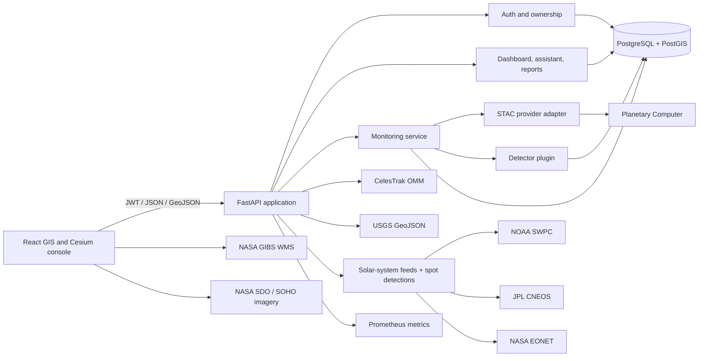

# Earth Monitoring Assistant

An auditable, map-first foundation for turning open satellite observations into reviewable change
events. The product UI is called **TerraLens**; this repository contains its FastAPI/PostGIS API,
React GIS console, monitoring adapters, analysis primitives, tests, and container deployment.

> This is a production-oriented first vertical slice, not a claim of worldwide AI coverage. Live
> Sentinel-2 catalogue ingestion works today, feeding a real pixel-level vegetation/burn-change
> detector and a continuous scheduler. Alert delivery, background job queues at scale, and precise
> (non-coarse) global tiling are planned behind the stable interfaces described below.

## What works today

- Local appliance mode (`LOCAL_MODE=true`): the console signs itself in as an
  auto-provisioned local operator with no login step — built for trusted-LAN,
  self-hosted deployments such as a Proxmox LXC
  ([deployment guide](docs/deploy-proxmox.md)); credential login remains the
  default everywhere else
- JWT sign-in with Argon2 password hashing and owner-scoped project access
- Projects and polygon watch areas stored in PostgreSQL/PostGIS (EPSG:4326)
- Event catalogue with geometry, confidence, severity, detector identity/version, evidence, and
  human-review status
- Search of recent Sentinel-2 L2A acquisitions through Microsoft Planetary Computer's STAC API
- CesiumJS 3D planetary operations view with atmosphere, lighting, timeline playback, VR mode,
  geodesic measurement, and optional Cesium World Terrain
- Current public OMM orbital elements from CelesTrak, browser-side SGP4 propagation, selectable
  spacecraft, ground tracks, nominal swaths, sensor footprints, state vectors, and watch-area pass
  estimates for public Sentinel, Landsat, Terra/Aqua, NOAA/JPSS, GOES, Meteosat, and selected Planet
  spacecraft
- Near-real-time NASA GIBS true colour, cloud, and thermal-anomaly layers plus the USGS all-day
  earthquake feed; every layer names its upstream source
- Live solar-system monitoring from keyless public feeds: NOAA SWPC space weather (GOES X-ray
  flux, flare events, solar wind, planetary K-index, protons), JPL SSD close approaches, NASA
  EONET open natural events, live SDO/SOHO solar imagery, and an in-process planetary ephemeris
  (JPL approximate Keplerian elements, 1800–2050)
- Versioned rule-based spot detections — flare classes, NOAA G/S storm scales, solar-wind
  anomalies, significant earthquakes, lunar-distance NEO gates, and open natural events — with
  deterministic ids, severity ranking, and per-feed graceful degradation, served over REST and a
  server-sent-events live stream
- A self-improving statistical layer: every live space-weather reading is archived locally,
  per-metric climatology (quantile baselines) is learned from that growing archive, adaptive
  anomaly thresholds tighten as history accumulates (never below published NOAA floors), and
  hourly damped-trend forecasts are issued and later **scored against what actually happened**
  next to a naive-persistence control — improvement is measured, never asserted (Insights page,
  `/api/v1/insights/*`)
- Autonomous space-imagery archiving: the scheduler continuously captures the latest SDO,
  SOHO/LASCO, GOES SUVI, and DSCOVR EPIC frames, deduplicates them by content hash, stores them
  on local disk with provenance, and prunes each source to a bounded archive (Space Gallery
  page, `/api/v1/imagery/*`)
- Solar System operations console: live orrery with planet inspector, multi-wavelength Sun
  imagery, X-ray/Kp/solar-wind charts, filterable detection feed, close-approach table, and EONET
  events rendered on the 3D globe
- Honest monitoring behavior: live STAC items become observations first and always; a real,
  evidence-backed vegetation/burn-change detector (dNBR + NDVI, Key & Benson 2006 thresholds) reads
  signed Sentinel-2 band windows and flags events only when a published threshold is cleared —
  every number in the evidence is reproducible by hand, never a fabricated score
- A single-process scheduler runs that same pipeline automatically for active watch areas on their
  configured cadence, so ingestion is continuous rather than click-triggered only
- A read-only, whole-planet **Global** live feed (six continent-scale watch areas, system-owned,
  visible to every signed-in user) runs the identical detector pipeline and streams live via SSE —
  additive to, and without weakening, the existing per-project owner scoping
- Vectorized remote-sensing primitives for 15 documented spectral indices, dNBR, masked change,
  and CRS/affine/nodata raster-grid validation
- GeoJSON event endpoints, dashboard aggregates, report generation, and constrained
  natural-language event filtering
- Responsive React/TypeScript console with MapLibre, React Query, Recharts, Tailwind CSS, and
  session restoration
- Alembic migration, deterministic seed data, health probes, Prometheus metrics, rate limiting,
  request IDs, security headers, non-root containers, and GitHub Actions CI

## Quick start

The supported path is Docker Compose because the API requires PostGIS.

```bash
cp .env.example .env
docker compose up --build
```

Open:

- Web console: <http://localhost:8080>
- OpenAPI: <http://localhost:8000/docs>
- API readiness: <http://localhost:8000/health/ready>
- Prometheus metrics: <http://localhost:8000/metrics>

The Compose default enables **local appliance mode** (`LOCAL_MODE=true`): the console
authenticates automatically as the auto-provisioned local operator, so there is no login step.
A credential account also exists for the token flow and API testing:

```text
Email:    analyst@terralens.app
Password: LocalAccess123!
```

The Compose credentials are for local evaluation only. Change the database password,
`SECRET_KEY`, local account, and CORS origins — and set `LOCAL_MODE=false` — before any shared
deployment. For hosting the stack as a LAN appliance on a Proxmox LXC container, follow
[docs/deploy-proxmox.md](docs/deploy-proxmox.md).

Stop the stack with `docker compose down`. Add `-v` only when you intentionally want to delete the
local database volume.

## Architecture



The central contract is deliberately small:

1. An `ImageryProvider` returns immutable source items and provenance.
2. A detector consumes suitable observations and returns evidence-backed detections.
3. The monitoring service persists observations before events.
4. API responses expose detector name/version, confidence, source evidence, and review state.

This keeps ingestion, scientific inference, product queries, and presentation independently
replaceable. See [architecture.md](docs/architecture.md) for data flow, boundaries, and the scaling
path.

## Repository layout

```text
backend/
  app/
    analysis/       Spectral-index, change, and raster-window-read primitives
    api/            Versioned HTTP routes and access checks
    bootstrap/      Idempotent startup bootstrap (global monitoring)
    core/           Configuration, database, security
    detectors/      Detector protocol and the real vegetation/burn-change detector
    imagery/        Autonomous live space-imagery harvesting and archiving
    learning/       Metric archive, adaptive baselines, self-scored forecasts
    models/         PostGIS-backed domain entities
    scheduling/     Continuous ingestion, learning, and imagery scheduler
    schemas/        Validated API contracts
    services/       Monitoring, assistant, and reporting use cases
  migrations/       Alembic database migration
  tests/            Backend unit tests
frontend/
  src/components/   GIS console, feed, auth, assistant
  src/lib/          Typed API client and tests
.github/             CI and dependency updates
docs/                Architecture, roadmap, and decisions
```

## Local development

### Backend

Python 3.12+ is required; CI uses 3.13.

```bash
python -m venv .venv
# Windows PowerShell
.\.venv\Scripts\Activate.ps1
pip install -e ".\backend[dev]"

cd backend
ruff check app tests
ruff format --check app tests
mypy app
pytest --cov=app --cov-report=term-missing
```

When runtime dependencies change, refresh the hashed container lock from the repository root:

```bash
pip-compile backend/pyproject.toml --output-file backend/requirements.lock \
  --generate-hashes --strip-extras
```

Set `DATABASE_URL` to an async Postgres URL before running migrations or the API outside Compose.

```bash
alembic upgrade head
python -m app.seed
uvicorn app.main:app --reload
```

### Frontend

Node 24 LTS is used by CI and the container build.

```bash
cd frontend
npm ci
npm run typecheck
npm test
npm run dev
```

Set `VITE_API_URL` at build time when the browser cannot reach `http://localhost:8000/api/v1`.
Set `VITE_CESIUM_ION_TOKEN` to enable Cesium World Terrain with vertex normals and water masks.
The application remains operational without a token using the WGS84 ellipsoid, OpenStreetMap,
and NASA GIBS imagery.

## API surface

All application endpoints live under `/api/v1`.

| Area | Endpoints | Purpose |
| --- | --- | --- |
| Authentication | `POST /auth/register`, `POST /auth/token`, `POST /auth/session`, `GET /auth/me` | Accounts, JWT sessions, and the LOCAL_MODE credential-free operator session |
| Projects | `GET/POST /projects`, `GET/PATCH/DELETE /projects/{id}` | Owned monitoring projects |
| Watch areas | `GET/POST /projects/{id}/watch-areas` | Validated WGS84 polygons and schedules |
| Events | `GET /events`, `GET /events/geojson`, `PATCH /events/{id}/review` | Catalogue, map features, and auditable review decisions |
| Monitoring | `GET /monitoring/observations`, `POST /monitoring/runs` | Live Sentinel-2 catalogue records and acquisition search |
| Planetary operations | `GET /planet/satellites`, `GET /planet/earthquakes` | Cached, validated CelesTrak OMM and USGS hazard feeds |
| Solar system | `GET /solar-system/overview`, `/space-weather`, `/ephemeris`, `/neo`, `/earth-events`, `/detections`, `GET /solar-system/stream` (SSE) | Live heliophysics, planet positions, close approaches, natural events, and rule-based spot detections |
| Dashboard | `GET /dashboard/summary` | Scoped operational aggregates |
| Global monitoring | `GET /global/events`, `/global/events/geojson`, `/global/summary`, `GET /global/stream` (SSE) | Read-only, whole-planet feed shared across all authenticated users |
| Adaptive learning | `GET /insights/status`, `/insights/baselines`, `/insights/forecasts` | Archive depth, learned climatology/thresholds, and self-scored forecasts |
| Space imagery | `GET /imagery/sources`, `/imagery/captures`, `GET /imagery/captures/{id}/file` | Autonomously archived, hash-deduplicated live space imagery |
| Assistant | `POST /assistant/query` | Deterministic natural-language filters |
| Reports | `GET/POST /reports` | Evidence summaries for selected periods |

Example sign-in:

```bash
curl -X POST http://localhost:8000/api/v1/auth/token \
  -H "Content-Type: application/x-www-form-urlencoded" \
  -d "username=analyst@terralens.app&password=LocalAccess123!"
```

Use the returned token as `Authorization: Bearer <token>`.

### Satellite monitoring

`POST /api/v1/monitoring/runs` queries recent cloud-filtered Sentinel-2 L2A items through the
Microsoft Planetary Computer and stores their STAC provenance. Metadata alone is never scientific
change evidence, so this step **always** creates observations only.

A real detector runs immediately after, on the observations that already exist for the watch area:
`VegetationChangeDetector` reads the signed NIR/Red/SWIR2 band windows for the two most recent
qualifying (cloud-filtered, sufficiently time-separated) observations, computes NDVI and dNBR, and
flags an event only when a published burn-severity or vegetation-loss threshold is cleared. An
event's `evidence` field always contains the exact before/after item ids and numbers a reviewer
needs to reproduce the result — this is a real detector, not a fabricated score, and it can
legitimately produce zero events when nothing has changed or too few observations exist yet.

`MonitoringScheduler` runs this same pipeline automatically for every active watch area on its
configured `schedule` (daily/weekly/manual), so a click on "Search live catalogue" is no longer the
only way new imagery gets checked.

### Adaptive learning (Insights)

The platform accumulates its own observational record instead of depending on upstream
retention. Every learning tick (5 minutes by default) archives the normalized NOAA SWPC
readings — Kp, GOES X-ray flux, solar-wind speed, IMF Bz, proton flux — into `metric_samples`.
From that archive it derives, per metric:

- **Learned climatology** — rolling-window quantiles (p50/p95/p99) of local history.
- **Adaptive anomaly thresholds** — once a metric has enough samples, the detection threshold
  may tighten from the published NOAA floor toward the locally observed p99 (p1 for Bz). It can
  never relax below the published floor, so learning adds early-warning sensitivity without
  suppressing any standard alert. These fire as `adaptive-baseline` detections in the live feed.
- **Self-scored forecasts** — hourly damped-trend forecasts for Kp and solar-wind speed at 3/6/
  12/24 h horizons, stored alongside a naive-persistence control and resolved against the sample
  nearest each target time. The Insights page reports mean absolute error and the trend model's
  error as a percentage of the control's: the system's claim to be "learning" is exactly that
  measured ratio, nothing more.

X-ray and proton flux are archived and baselined but deliberately not trend-forecast: impulsive
series make linear extrapolation dishonest.

### Space imagery archive (Space Gallery)

The scheduler sweeps nine keyless public sources — five SDO channels, SOHO/LASCO C2 + C3, GOES
SUVI 19.5 nm, and DSCOVR EPIC natural colour — every 15 minutes. Each frame is hashed; only
genuinely new content is written to disk and catalogued with source, upstream URL, capture time,
and byte size. Each source is pruned to a bounded number of frames, so the archive grows with
what the Sun and Earth actually do, not with wall-clock time.

### Planet 3D operations

Open **Planet 3D** after signing in. The globe propagates validated CelesTrak OMM elements with
SGP4 against the Cesium clock, so moving the timeline changes spacecraft positions. Selecting a
spacecraft exposes its propagated altitude, velocity and heading; nominal instrument metadata;
historical/upcoming ground track; swath; next pass above 10 degrees over the active watch area;
and matching stored STAC acquisitions where available. The layer deck controls NASA VIIRS true
colour, MODIS cloud fraction, VIIRS thermal anomalies, USGS earthquakes, footprints, and STAC
observation geometry.

Orbital elements are cached for two hours and the earthquake feed for one minute. These are
source-backed operational data, but they are not spacecraft telemetry. Instrument status, tasking,
private Planet imagery, AIS, and ADS-B are not fabricated: those require mission/provider APIs and
credentials before they can be shown. Mission swaths and revisit intervals are labelled nominal,
and pass times are SGP4 estimates rather than acquisition commitments.

## Security posture

- Every project, watch area, event, report, and assistant query is scoped through the authenticated
  owner.
- Public registration is disabled by default and enabled explicitly by the local Compose profile.
- `LOCAL_MODE` (off by default) issues a credential-free session for one auto-provisioned local
  operator whose password is random and undisclosed; every downstream request still carries a
  normal short-lived JWT. Enable it only on trusted networks — it is an appliance convenience,
  not an internet-facing posture.
- Passwords use Argon2; access tokens are signed HS256 JWTs with expiry, role, and token type.
- Request bodies use Pydantic validation, including closed WGS84 polygons and password strength.
- API responses carry request IDs and baseline browser security headers.
- A bounded in-process rate limiter protects local/single-node deployments. Multi-replica
  production should enforce shared limits at the gateway (or Redis), not rely on process memory.
- Containers run as non-root where practical. Secrets are injected at runtime and are not baked
  into images.

Read [SECURITY.md](SECURITY.md) before deploying. In particular, replace all example credentials,
disable public registration, terminate TLS at a trusted ingress, restrict `/metrics`, set explicit
allowed hosts/origins, and use a managed secret store.

## Scientific integrity

Satellite analytics can affect disaster response, land management, insurance, and public policy.
The platform therefore distinguishes:

- **Observation** — a traceable acquisition or data source.
- **Detection** — a model or algorithm output with version, confidence, geometry, and evidence.
- **Event** — a persisted detection presented for analyst review.
- **Reviewed event** — a human decision, not merely a high confidence score.

Confidence is not probability of truth unless the deployed model has been calibrated for the
target geography, season, sensor, and phenomenon. Production model cards should document data
lineage, spatial leakage controls, subgroup/geography performance, thresholds, uncertainty, and
known failure modes.

## Delivery roadmap

The master vision spans many distinct scientific products. Building them all as one universal
model would be brittle. The recommended sequence is:

1. Harden this environmental-change vertical slice with real COG processing, cloud masks, queues,
   object storage, and analyst review.
2. Add one validated detector at a time (flood extent, burn severity, vegetation loss), each with
   domain datasets, benchmarks, and model cards.
3. Add scheduled workflows, alert policies, export formats, and team collaboration.
4. Partition by region/time, serve raster/vector tiles, add distributed workers, and introduce a
   feature store/model registry only when load requires them.
5. Expand into agriculture, urban, infrastructure, disaster, and maritime packs without coupling
   their scientific lifecycles.

The detailed acceptance criteria are in [roadmap.md](docs/roadmap.md).

The full engineering review, weakness register, production architecture, iteration record, and
migration gates are in [ULTIMATE_EARTH_MONITOR_BUILD.md](docs/ULTIMATE_EARTH_MONITOR_BUILD.md).
Scientific formulas and validation assumptions are documented in
[scientific-methods.md](docs/scientific-methods.md).

## Contributing

See [CONTRIBUTING.md](CONTRIBUTING.md). Changes should preserve provenance, ownership isolation,
typed contracts, and the rule that observations never silently become detections.
