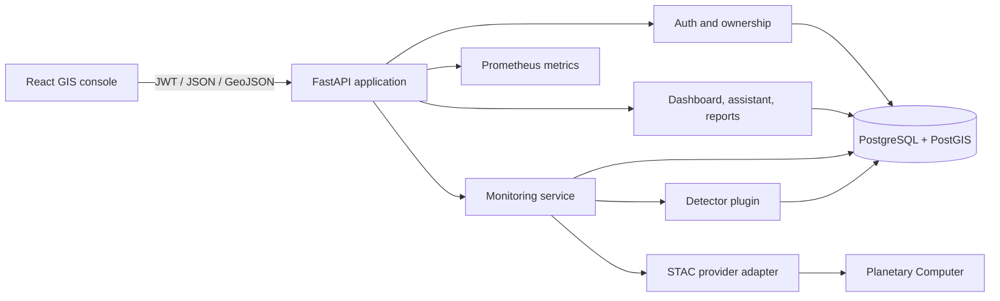

# Earth Monitoring Assistant

An auditable, map-first foundation for turning open satellite observations into reviewable change
events. The product UI is called **TerraLens**; this repository contains its FastAPI/PostGIS API,
React GIS console, monitoring adapters, analysis primitives, tests, and container deployment.

> This is a production-oriented first vertical slice, not a claim of worldwide AI coverage. Live
> Sentinel-2 catalogue ingestion works today. Demo detections are explicitly labelled. Operational
> pixel-level detectors, background queues, alert delivery, and global tiling are planned behind
> stable interfaces described below.

## What works today

- JWT sign-in with Argon2 password hashing and owner-scoped project access
- Projects and polygon watch areas stored in PostgreSQL/PostGIS (EPSG:4326)
- Event catalogue with geometry, confidence, severity, detector identity/version, evidence, and
  human-review status
- Search of recent Sentinel-2 L2A acquisitions through Microsoft Planetary Computer's STAC API
- Honest monitoring behavior: live STAC items become observations; only the labelled demo provider
  creates synthetic events
- Remote-sensing primitives for NDVI, NDWI, NBR, and masked threshold change
- GeoJSON event endpoints, dashboard aggregates, report generation, and constrained
  natural-language event filtering
- Responsive React/TypeScript console with MapLibre, React Query, Recharts, Tailwind CSS, and
  session restoration
- Alembic migration, deterministic seed data, health probes, Prometheus metrics, rate limiting,
  request IDs, security headers, non-root containers, and GitHub Actions CI

## Quick start

The supported path is Docker Compose because the API requires PostGIS.

```bash
cp .env.example .env
docker compose up --build
```

Open:

- Web console: <http://localhost:8080>
- OpenAPI: <http://localhost:8000/docs>
- API readiness: <http://localhost:8000/health/ready>
- Prometheus metrics: <http://localhost:8000/metrics>

Seeded demo account:

```text
Email:    analyst@example.com
Password: ChangeMe123!
```

The Compose credentials are for local evaluation only. Change the database password,
`SECRET_KEY`, demo account, and CORS origins before any shared deployment.

Stop the stack with `docker compose down`. Add `-v` only when you intentionally want to delete the
local database volume.

## Architecture



The central contract is deliberately small:

1. An `ImageryProvider` returns immutable source items and provenance.
2. A detector consumes suitable observations and returns evidence-backed detections.
3. The monitoring service persists observations before events.
4. API responses expose detector name/version, confidence, source evidence, and review state.

This keeps ingestion, scientific inference, product queries, and presentation independently
replaceable. See [architecture.md](docs/architecture.md) for data flow, boundaries, and the scaling
path.

## Repository layout

```text
backend/
  app/
    analysis/       Spectral-index and change primitives
    api/            Versioned HTTP routes and access checks
    core/           Configuration, database, security
    models/         PostGIS-backed domain entities
    schemas/        Validated API contracts
    services/       Monitoring, assistant, and reporting use cases
  migrations/       Alembic database migration
  tests/            Backend unit tests
frontend/
  src/components/   GIS console, feed, auth, assistant
  src/lib/          Typed API client and tests
.github/             CI and dependency updates
docs/                Architecture, roadmap, and decisions
```

## Local development

### Backend

Python 3.12+ is required; CI uses 3.13.

```bash
python -m venv .venv
# Windows PowerShell
.\.venv\Scripts\Activate.ps1
pip install -e ".\backend[dev]"

cd backend
ruff check app tests
ruff format --check app tests
mypy app
pytest --cov=app --cov-report=term-missing
```

When runtime dependencies change, refresh the hashed container lock from the repository root:

```bash
pip-compile backend/pyproject.toml --output-file backend/requirements.lock \
  --generate-hashes --strip-extras
```

Set `DATABASE_URL` to an async Postgres URL before running migrations or the API outside Compose.

```bash
alembic upgrade head
python -m app.seed
uvicorn app.main:app --reload
```

### Frontend

Node 24 LTS is used by CI and the container build.

```bash
cd frontend
npm ci
npm run typecheck
npm test
npm run dev
```

Set `VITE_API_URL` at build time when the browser cannot reach `http://localhost:8000/api/v1`.

## API surface

All application endpoints live under `/api/v1`.

| Area | Endpoints | Purpose |
| --- | --- | --- |
| Authentication | `POST /auth/register`, `POST /auth/token`, `GET /auth/me` | Accounts and JWT sessions |
| Projects | `GET/POST /projects`, `GET/PATCH/DELETE /projects/{id}` | Owned monitoring projects |
| Watch areas | `GET/POST /projects/{id}/watch-areas` | Validated WGS84 polygons and schedules |
| Events | `GET /events`, `GET /events/geojson`, `PATCH /events/{id}/review` | Catalogue, map features, and auditable review decisions |
| Monitoring | `POST /monitoring/runs` | Demo run or live STAC acquisition search |
| Dashboard | `GET /dashboard/summary` | Scoped operational aggregates |
| Assistant | `POST /assistant/query` | Deterministic natural-language filters |
| Reports | `GET/POST /reports` | Evidence summaries for selected periods |

Example sign-in:

```bash
curl -X POST http://localhost:8000/api/v1/auth/token \
  -H "Content-Type: application/x-www-form-urlencoded" \
  -d "username=analyst@example.com&password=ChangeMe123!"
```

Use the returned token as `Authorization: Bearer <token>`.

### Monitoring modes

`POST /api/v1/monitoring/runs` accepts one of two providers:

- `demo`: creates one deterministic demo observation and, once per hourly source item, one clearly
  labelled event for interface evaluation.
- `planetary-computer`: queries recent cloud-filtered Sentinel-2 L2A items and stores their STAC
  provenance. It creates **no event** because metadata alone is not scientific change evidence.

This safety property is intentional. A real detector should implement the detector contract, read
the necessary signed assets, apply cloud/quality masks, align acquisitions, calculate metrics or
model outputs, and return its evidence bundle.

## Security posture

- Every project, watch area, event, report, and assistant query is scoped through the authenticated
  owner.
- Public registration is disabled by default and enabled explicitly by the local Compose profile.
- Passwords use Argon2; access tokens are signed HS256 JWTs with expiry, role, and token type.
- Request bodies use Pydantic validation, including closed WGS84 polygons and password strength.
- API responses carry request IDs and baseline browser security headers.
- A bounded in-process rate limiter protects local/single-node deployments. Multi-replica
  production should enforce shared limits at the gateway (or Redis), not rely on process memory.
- Containers run as non-root where practical. Secrets are injected at runtime and are not baked
  into images.

Read [SECURITY.md](SECURITY.md) before deploying. In particular, replace all example credentials,
disable public registration, terminate TLS at a trusted ingress, restrict `/metrics`, set explicit
allowed hosts/origins, and use a managed secret store.

## Scientific integrity

Satellite analytics can affect disaster response, land management, insurance, and public policy.
The platform therefore distinguishes:

- **Observation** — a traceable acquisition or data source.
- **Detection** — a model or algorithm output with version, confidence, geometry, and evidence.
- **Event** — a persisted detection presented for analyst review.
- **Reviewed event** — a human decision, not merely a high confidence score.

Confidence is not probability of truth unless the deployed model has been calibrated for the
target geography, season, sensor, and phenomenon. Production model cards should document data
lineage, spatial leakage controls, subgroup/geography performance, thresholds, uncertainty, and
known failure modes.

## Delivery roadmap

The master vision spans many distinct scientific products. Building them all as one universal
model would be brittle. The recommended sequence is:

1. Harden this environmental-change vertical slice with real COG processing, cloud masks, queues,
   object storage, and analyst review.
2. Add one validated detector at a time (flood extent, burn severity, vegetation loss), each with
   domain datasets, benchmarks, and model cards.
3. Add scheduled workflows, alert policies, export formats, and team collaboration.
4. Partition by region/time, serve raster/vector tiles, add distributed workers, and introduce a
   feature store/model registry only when load requires them.
5. Expand into agriculture, urban, infrastructure, disaster, and maritime packs without coupling
   their scientific lifecycles.

The detailed acceptance criteria are in [roadmap.md](docs/roadmap.md).

## Contributing

See [CONTRIBUTING.md](CONTRIBUTING.md). Changes should preserve provenance, ownership isolation,
typed contracts, and the rule that real observations never silently become demo detections.
