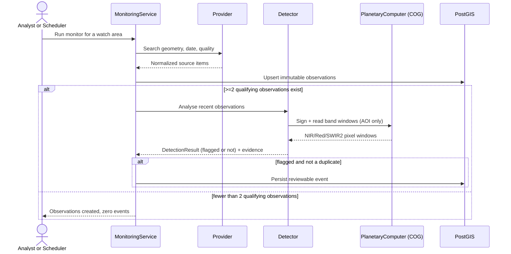

# Architecture

## Design goals

The foundation optimises for scientific traceability, tenant isolation, replaceable providers and
models, and a low-friction local environment. It intentionally starts as a modular monolith. The
domain boundaries are explicit enough to extract into services when queue depth, release cadence,
or team ownership justifies the operational cost.

## Runtime boundaries

### Web console

The React application owns presentation state only. React Query handles server state; the map
consumes API-produced GeoJSON; assistant responses include interpreted filters so a user can see
how a question was translated. Large GIS code is lazy-loaded after authentication.

### API

FastAPI provides validation, OpenAPI, authentication, ownership checks, orchestration, reporting,
and query endpoints. Routes do not call external imagery sources directly: the monitoring service
selects a provider adapter and owns persistence order.

### Database

PostgreSQL is the transaction system; PostGIS stores watch areas, source footprints, and event
geometries in EPSG:4326. Composite and spatial indexes support the first query patterns. At higher
volume, observations and events should be range-partitioned by capture/detection month, with region
or H3/S2 cells as secondary distribution keys.

### Providers and detectors

`ImageryProvider.search()` returns normalized `ImageryItem` objects. Provider-specific STAC fields
stay in `metadata_json`; useful assets retain their href and media type. The first live provider is
Microsoft Planetary Computer Sentinel-2 L2A.

Live catalogue ingestion always persists observations first and independently of any detector; a
detector only ever adds evidence-backed events on top. `Detector` (`app/detectors/base.py`) is a
small protocol — immutable `name`/`version`, `async detect(context) -> list[DetectionResult]` — so
`MonitoringService` composes detectors without owning their internals. The first concrete detector,
`VegetationChangeDetector` (`app/detectors/vegetation_change.py`), compares the two most recent
cloud-filtered Sentinel-2 observations for a watch area: `app/analysis/raster_io.py` opens the
Planetary Computer's signed COG band assets and reads only the pixel window covering the watch
area (never a full scene), and `app/analysis/indices.py`'s existing NDVI/NBR/dNBR primitives decide
whether the change clears a published threshold (Key & Benson 2006 burn-severity breakpoints, plus
an NDVI-drop gate excluding never-vegetated pixels). Every number on a flagged event's evidence —
before/after item ids, mean/max dNBR, changed-pixel fraction, thresholds applied — is reproducible
by hand; nothing is a fabricated confidence score. A detector failure (bad COG, network blip) is
caught at the `MonitoringService` boundary and never rolls back the observations already committed.

### Continuous ingestion

`MonitoringScheduler` (`app/scheduling/monitoring_scheduler.py`) is a single-process
`AsyncIOScheduler` that periodically asks which active watch areas are due (per their `schedule`
field: daily/weekly/manual) and runs the identical `MonitoringService` pipeline used by the manual
"Search live catalogue" action — ingestion is no longer only click-triggered. Three independent
layers prevent duplicate/overlapping work: a per-watch-area in-process lock, the existing
`Observation` unique constraint, and event deduplication by (detector, before-item, after-item) in
`MonitoringService`. This is intentionally single-process, matching the modular-monolith design
goal; multi-process/horizontal scheduling would need a durable job-lock table (see Scaling path).

### Global monitoring

Every other endpoint resolves data through `Project.owner_id == current_user.id`; that boundary is
untouched everywhere else. `/api/v1/global/*` (`app/api/global_monitoring.py`) is a single, narrow,
explicitly-documented exception: any authenticated user (never anonymous) may read a system-owned
"Global Monitoring" project's six continent-scale watch areas, bootstrapped idempotently at startup
by `app/bootstrap/global_monitoring.py` under an account that can never authenticate
(`role=system`, `is_active=False`). The scheduler treats these watch areas like any other — no
special-casing — so the same real detector produces the same evidence-backed events there. This
endpoint group is read-only; the scheduler is the only writer.

### Solar-system live feeds and spot detections

The solar-system module aggregates keyless public feeds — NOAA SWPC space weather (GOES X-ray
flux, flare events, solar-wind plasma/IMF, planetary K-index, integral protons), JPL SSD/CNEOS
close-approach data, NASA EONET open natural events, USGS earthquakes, and live SDO/SOHO solar
imagery URLs — plus an in-process planetary ephemeris derived from the JPL approximate Keplerian
elements (valid 1800–2050, arcminute-class accuracy; situational awareness, not navigation).

Every upstream fetch is retried with backoff and cached in process memory with a feed-specific
TTL, so the SSE stream and many concurrent dashboards do not multiply provider load. One failing
feed degrades the overview (`feed_status`) instead of failing the request. Spot detections are
pure, versioned rules over the normalized feeds (NOAA R/G/S scale mappings, magnitude/recency
thresholds, lunar-distance NEO gates) with deterministic identifiers so clients can deduplicate
across refreshes. Stale solar-wind readings are excluded from "current" state and therefore
cannot trigger anomaly detections. These detections signal operating conditions from authoritative
sources; they are distinct from the imagery detector contract above and are never persisted as
reviewable events.

## Data lifecycle

The scheduler (`app/scheduling/monitoring_scheduler.py`) is the "Scheduler" trigger above, running
the same pipeline on an interval instead of only on a manual click. The service itself is still
synchronous per run to keep it inspectable; only the band reads are offloaded to a thread executor
so they don't block the event loop. Before processing raster assets at much larger scale, the API
should move to an idempotent job queue and return `202 Accepted` with a run resource.

The same scheduler owns two further autonomous loops:

- **Learning tick** (`app/learning/`, default every 5 minutes): archives normalized SWPC
  space-weather readings into `metric_samples`, resolves matured `metric_forecasts` rows against
  the nearest recorded observation, issues a fresh hourly forecast set (damped-trend plus a
  naive-persistence control per metric/horizon), and prunes the archive past retention daily.
  Baselines derived from this archive feed `adaptive-baseline` spot detections; learned
  thresholds may only ever be *stricter* than the published NOAA floors, so the static detector
  contract is never weakened. Forecast "skill" is the measured error ratio against persistence —
  the self-improvement claim is exactly that number.
- **Imagery tick** (`app/imagery/`, default every 15 minutes): resolves each registered source
  (static latest-frame URLs for SDO/SOHO/SUVI; the EPIC index API for DSCOVR) to a concrete
  frame, downloads with size/content-type gates, deduplicates by SHA-256, writes to the imagery
  volume, records provenance in `imagery_captures`, and prunes each source to a bounded count.

Both loops degrade per tick (a feed outage skips that step and logs) and neither can crash the
scheduler. Local appliance mode (`LOCAL_MODE`, `app/bootstrap/local_mode.py`) adds a
credential-free session endpoint for one auto-provisioned operator; every downstream
authorization path is unchanged because the endpoint still issues a standard short-lived JWT.

## Scaling path

| Pressure | First response | Later response |
| --- | --- | --- |
| Slow raster inference | Durable queue and separate worker image | GPU pools by detector family |
| Large imagery | COGs in S3-compatible object storage | Lifecycle policies and regional replication |
| Expensive map queries | Materialized summaries and vector tiles | Dedicated tile service and CDN |
| Growing event table | Monthly partitions and retention policy | Regional database shards |
| Many schedules | Single-process scheduler (in place) outgrowing one process | Durable job-lock table + partitioned workflow engine |
| Many replicas | Gateway/Redis rate limits | Tenant quotas and cost controls |
| Model proliferation | Model cards + immutable artifact versions | Registry, approval gates, drift monitoring |

Do not split services solely to match the target diagram. Extract only around a durable queue or
data ownership boundary; otherwise distributed transactions and observability costs arrive before
the scale problem.

## Reliability and observability

- Liveness does not touch dependencies; readiness verifies the database.
- Prometheus records HTTP request count, duration, and response sizes.
- `X-Request-ID` propagates or creates a request correlation identifier.
- Monitoring writes observations before detections in one transaction and treats source item IDs
  as idempotent within a watch area.
- Provider failures return a bounded 502 response without committing partial state.

Next reliability work: structured JSON logs, OpenTelemetry traces, durable job/run tables,
dead-letter handling, retries with jitter, object-store checksum verification, and SLO dashboards.

## Geospatial conventions

- API polygons are GeoJSON longitude/latitude in WGS84 and must be closed.
- Database geometries use SRID 4326.
- Area/distance calculations must transform into a suitable projected CRS or use geography; never
  treat degrees as metres.
- Raster analysis should preserve source CRS during resampling and record transform, resolution,
  nodata, masks, resampling method, and source checksums.
- Antimeridian and polar regions require explicit geometry normalization and tiling tests before
  worldwide claims.

## Security boundaries

The API resolves resources through owner-scoped joins rather than fetching an object and checking
ownership later. This makes “not owned” indistinguishable from “not found.” Roles exist in tokens
and users, but collaboration and organization membership are not implemented yet; do not infer
team-level authorization from the role field alone.

Production ingress should provide TLS, allowed-host validation, shared rate limits, WAF policy,
private metrics, and request-size limits. Database credentials should be short-lived where the
cloud platform supports it.
