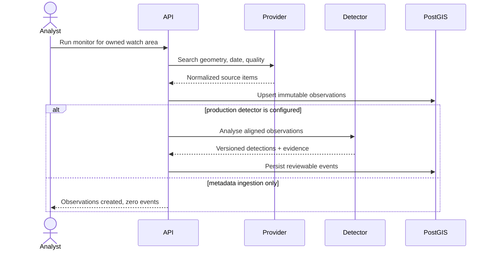

# Architecture

## Design goals

The foundation optimises for scientific traceability, tenant isolation, replaceable providers and
models, and a low-friction local environment. It intentionally starts as a modular monolith. The
domain boundaries are explicit enough to extract into services when queue depth, release cadence,
or team ownership justifies the operational cost.

## Runtime boundaries

### Web console

The React application owns presentation state only. React Query handles server state; the map
consumes API-produced GeoJSON; assistant responses include interpreted filters so a user can see
how a question was translated. Large GIS code is lazy-loaded after authentication.

### API

FastAPI provides validation, OpenAPI, authentication, ownership checks, orchestration, reporting,
and query endpoints. Routes do not call external imagery sources directly: the monitoring service
selects a provider adapter and owns persistence order.

### Database

PostgreSQL is the transaction system; PostGIS stores watch areas, source footprints, and event
geometries in EPSG:4326. Composite and spatial indexes support the first query patterns. At higher
volume, observations and events should be range-partitioned by capture/detection month, with region
or H3/S2 cells as secondary distribution keys.

### Providers and detectors

`ImageryProvider.search()` returns normalized `ImageryItem` objects. Provider-specific STAC fields
stay in `metadata_json`; useful assets retain their href and media type. The first live provider is
Microsoft Planetary Computer Sentinel-2 L2A.

Live catalogue ingestion never invokes a detector. A production detector must expose its name and
immutable version, validate required bands/quality assets, and return evidence sufficient to
reproduce or review the output.

### Solar-system live feeds and spot detections

The solar-system module aggregates keyless public feeds — NOAA SWPC space weather (GOES X-ray
flux, flare events, solar-wind plasma/IMF, planetary K-index, integral protons), JPL SSD/CNEOS
close-approach data, NASA EONET open natural events, USGS earthquakes, and live SDO/SOHO solar
imagery URLs — plus an in-process planetary ephemeris derived from the JPL approximate Keplerian
elements (valid 1800–2050, arcminute-class accuracy; situational awareness, not navigation).

Every upstream fetch is retried with backoff and cached in process memory with a feed-specific
TTL, so the SSE stream and many concurrent dashboards do not multiply provider load. One failing
feed degrades the overview (`feed_status`) instead of failing the request. Spot detections are
pure, versioned rules over the normalized feeds (NOAA R/G/S scale mappings, magnitude/recency
thresholds, lunar-distance NEO gates) with deterministic identifiers so clients can deduplicate
across refreshes. Stale solar-wind readings are excluded from "current" state and therefore
cannot trigger anomaly detections. These detections signal operating conditions from authoritative
sources; they are distinct from the imagery detector contract above and are never persisted as
reviewable events.

## Data lifecycle

The current service is synchronous to keep the vertical slice inspectable. Before processing raster
assets, the API should enqueue an idempotent job and return `202 Accepted` with a run resource.

## Scaling path

| Pressure | First response | Later response |
| --- | --- | --- |
| Slow raster inference | Durable queue and separate worker image | GPU pools by detector family |
| Large imagery | COGs in S3-compatible object storage | Lifecycle policies and regional replication |
| Expensive map queries | Materialized summaries and vector tiles | Dedicated tile service and CDN |
| Growing event table | Monthly partitions and retention policy | Regional database shards |
| Many schedules | Scheduler emitting idempotent jobs | Partitioned workflow engine |
| Many replicas | Gateway/Redis rate limits | Tenant quotas and cost controls |
| Model proliferation | Model cards + immutable artifact versions | Registry, approval gates, drift monitoring |

Do not split services solely to match the target diagram. Extract only around a durable queue or
data ownership boundary; otherwise distributed transactions and observability costs arrive before
the scale problem.

## Reliability and observability

- Liveness does not touch dependencies; readiness verifies the database.
- Prometheus records HTTP request count, duration, and response sizes.
- `X-Request-ID` propagates or creates a request correlation identifier.
- Monitoring writes observations before detections in one transaction and treats source item IDs
  as idempotent within a watch area.
- Provider failures return a bounded 502 response without committing partial state.

Next reliability work: structured JSON logs, OpenTelemetry traces, durable job/run tables,
dead-letter handling, retries with jitter, object-store checksum verification, and SLO dashboards.

## Geospatial conventions

- API polygons are GeoJSON longitude/latitude in WGS84 and must be closed.
- Database geometries use SRID 4326.
- Area/distance calculations must transform into a suitable projected CRS or use geography; never
  treat degrees as metres.
- Raster analysis should preserve source CRS during resampling and record transform, resolution,
  nodata, masks, resampling method, and source checksums.
- Antimeridian and polar regions require explicit geometry normalization and tiling tests before
  worldwide claims.

## Security boundaries

The API resolves resources through owner-scoped joins rather than fetching an object and checking
ownership later. This makes “not owned” indistinguishable from “not found.” Roles exist in tokens
and users, but collaboration and organization membership are not implemented yet; do not infer
team-level authorization from the role field alone.

Production ingress should provide TLS, allowed-host validation, shared rate limits, WAF policy,
private metrics, and request-size limits. Database credentials should be short-lived where the
cloud platform supports it.
